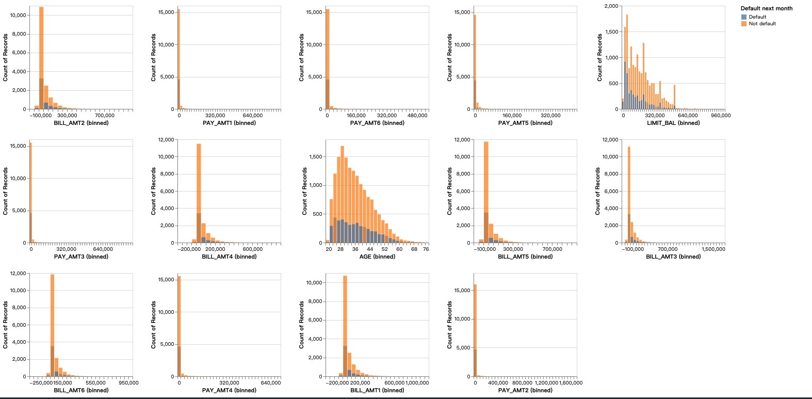
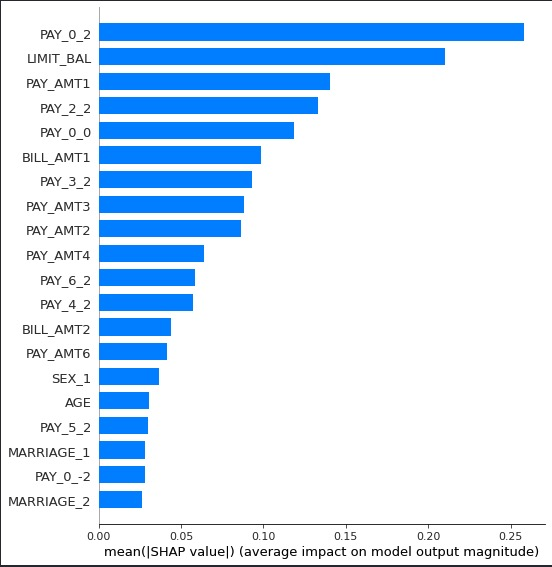
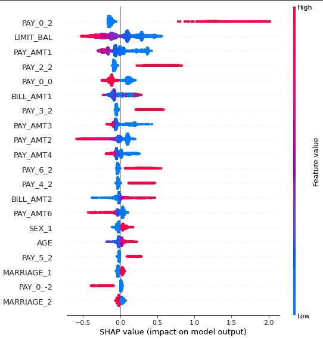

```{r setup, include=FALSE}
knitr::opts_chunk$set(echo = FALSE)
library(knitr)
library(RefManageR)
```

## 0. Online-Book Link
Link:[https://pandasang1231.github.io/542_report/notebooks.html](https://pandasang1231.github.io/542_report/notebooks.html)

## 1. Audience persona

<font size=3>Rui Yan and I work together in risk management at a financial institution. I am the data scientist on the data science team and Yan is the risk management strategy leader on the analytics team. Rui Yan graduated from the University of British Columbia with a major in mathematics and has ten years of work experience in data analysis. He has a basic understanding of data mining. Rui Yan looks forward to implementing risk control on the company's loan business based on the prediction results of the risk model and in line with the risk management rules of the data analysis team. As a result, he has high requirements for the performance and interpretability of the model.</font>

## 2. Abstract

<font size=3>Since the popularity of the standard scorecard approach, the scorecard model has become a widely used risk management strategy by banks and credit card institutions. The essence of the risk management model is to use WOE and logistic regression to predict whether the user will have default risk based on the user's basic financial and asset proof. Such models have a mature methodology, strong interpretability, and stability. However, with the explosive growth of the amount of data, the new big data risk model far exceeds the traditional scorecard model in the quantity of collected data, as well as in the final performance.

<font size=3>This report constructs a LightGBM model of classification to predict customers' future default risk, according to customers' payment history and personal information. For this problem, you will use [Default of Credit Card Clients Dataset](https://www.kaggle.com/uciml/default-of-credit-card-clients-dataset). In this data set, there are 30,000 examples and 24 features, and the goal is to estimate whether a person will default (fail to pay) their credit card bills. Given the data, we were most interested in whether greater training complexity and model parameters can improve model performance, under the premise of similar overfitting and model interpretability. As a result, several methods were used to build prediction model including SVM, Random Forest, LightGBM and baseline model Logistic Regression. The results showed that LightGBM was superior to other methods with the highest valid accuracy and recall (0.816\0.622). Therefore, compared to traditional Logistic Regression, LightGBM does exceed in all metrics including accuracy, recall and AUC. Meanwhile, When faced with a dataset with a larger amount of data, due to the complexity of the model, LightGBM will even have a greater advantage over Logistic Regression. Finally, features‘ split importance and shap values were summarized by the model. It shows the fact that LightGBM also has a good interpretability like logistic regression.

## 3. Introduction

<font size=3>Risk management capability is a core capability of any financial institution. Risk management capabilities largely determine a company's service offerings, prices, and profitability. In extreme cases, the risk management capability of a financial institution can make or break the institution's existence. If the service recipient can obtain a loan at an interest rate commensurate with its risk level, the loan interest repayment can make up for the loss of individual non-performing loans. Otherwise, financial institutions run the risk of failing.

<font size=3>In 1995, D.J. HAND and W.E. HENLEY reviewed the scorecard approach to credit default ratings in a paper [Statistical Classification Methods in Consumer Credit Scoring: a Review](http://www.sfu.ca/~rjones/bus864/readings/HandHenley1997JRSS.pdf). That paper focused on methods for categorizing credit applicants based on their likely repayment behavior. The traditional scorecard model replaces what was originally based on human expert judgment. The principle of the credit scorecard model is a generalized linear model of a binary variable using a logistic regression model after discretizing the WOE coding method of the model variable. Manual judgment is still the mainstream in high-amount, low-frequency lending scenarios, such as home loans and car loans. However, because of the popularity of credit cards and small loans, the machine-based model review is gaining more and more attention in these scenarios. 

<font size=3>In 2015 and 2017, two effective implementations of Gradient Boosting Decision Tree (GBDT) was publiced. Those two paper are listed here.[XGBoost: A Scalable Tree Boosting System](https://dl.acm.org/doi/abs/10.1145/2939672.2939785), [LightGBM: A Highly Efficient Gradient Boosting Decision Tree](https://proceedings.neurips.cc/paper/2017/file/6449f44a102fde848669bdd9eb6b76fa-Paper.pdf).The residual calculation of each step actually increases the weight of the wrongly classified instance, while the instances that have been paired tend to be zero. In this way, later trees can focus more and more on those instances that were misclassified earlier. It has many nonlinear transformations, strong expressive ability, and does not require complex feature engineering and feature transformation.

<font size=3>Compared with traditional bank risk management, big data risk management has an advantage. The former basically uses traditional financial data to establish rules and scorecard models, such as income certificates, credit card records, property certificates. However, big data models can use more types of data to build complex and sophisticated risk systems. This is also the reason why we choose LightGBM to train the data in the report. In this report, we compared Random Forest, LightGBM to Logistic Regression in the credit default data. After the experiment, we found that LGBM performed better on the training set and improved on the test set compared to Logistic Regression. In addition, the gap between the training set and the test set is also acceptable.


## 4. Methods


### 4.1 Software
- The whole process is conducting with Python.
- Repository link: [https://github.ubc.ca/mds-2021-22/DSCI_573_lab4_luming21](https://github.ubc.ca/mds-2021-22/DSCI_573_lab4_luming21)


### 4.2 Data collection
<font size=3>Our study took payment data on Kaggle. The origin data was in October, 2005, from an important bank in Taiwan and the targets were credit card holders of the bank. In this data set, there are 30,000 examples and 24 features, and the goal is to estimate whether a person will default (fail to pay) their credit card bills; this column is labeled "default.payment.next.month" in the data, as the response variable. The rest of the columns can be used as features. The columns' description can be listed as below:


|  Var_Name         | Var_Description                                                                                      |
|:------------------|:-----------------------------------------------------------------------------------------------------|
| LIMIT_BAL         | Amount of given credit in NT dollars                                                                 |
| SEX               | Gender (1=male, 2=female)                                                                            |
| EDUCATION         | Education level (1=graduate school, 2=university, 3=high school, 4=others, 5=unknown, 6=unknown)     |
| MARRIAGE          | Marital status (1=married, 2=single, 3=others)                                                       |
| AGE               | Age in years                                                                                         |
| PAY_i             | (i ranges from 0 to 6) Repayment status in one of the previous 6 months respectively; (-1=pay duly, 1 to 8 =payment delay for number of months, 9=payment delay for nine months and above)               |
| BILL_AMTi         | (i ranges from 0 to 6) Amount of bill statement in (NT dollar) in a month (e.g.September, 2005)      |
| PAY_AMTi          | (i ranges from 0 to 6) Amount of previous payment in a month (e.g.September, 2005)                   |


### 4.3 Data Preprocessing
<font size=3>We checked the integrity of the data. Since the open-source time of this data is 2005, and the data processing is highly completed, we observed that the exact value in the data has been processed. Therefore, in data preprocessing, we focus on processing the data into a form suitable for the model.

<font size=3>We dropped the ID column that did not contribute to the target. For continuous variables, we used StandardScaler for preprocessing. For categorical variables, we first convert them to integer variables and then use OneHotEncoder for preprocessing.


### 4.4 Data analysis and Model
<font size=3>There are a few key points worth noting about the model building.

<font size=3>Regarding the division of data and the avoidance of data leakage, we divided the data into three parts. They are training set, validation set, and test set. In order to avoid the information leakage of training data and evaluation data, we divided the data into the training set and test set by time as the split point. In order to verify the over-fitting of the model on the data, we divided the training set into a training set and validation set by random numbers. The ratio of the final training set/validation set/test set was 7/2/1, respectively.

<font size=3>For model validation indicators, risk management models usually ignore the accuracy of the model because of the imbalance in the sample categories of credit lending. We focued on evaluating two metrics in the report, KS and recall. For the problem of sample category imbalance, fortunately, Logistic Regression and LightGBM have parameters to eliminate the problem of sample imbalance.

<font size=3>With logistic regression model, we did hyperparameter tuning with "penalty", "C" and "class_weight" hyperparameters. With GBDT based model, we did hyperparameter tuning with "n_estimators", "max_depth" and "class_weight" hyperparameters.

## 5. Results

### 5.1 EDA

<font size=3>As below, there are two plots that are respectively EDA results of categorical variables and numeric features. The first graph showed the distributions of categorical variables for different target classes. We observed that people who have delayed their payment in the past 6 months are more likely to delay it again.The second graph shows the distributions of numeric features for the two target classes. We do not observe obvious relationships between those features and the target classes. 

{width=500px}

{width=500px}


### 5.2 Model

<font size=3>We passed recall as our refit parameter during RandomizedSearchCV because we care more about false negative errors. The best parameters for max_bin is 21, max_depth is 3, and 'class_weight' is 'balanced'. The cross validation recall score of the optimized LGBM model is 0.636.

|    | model_name                   | fit_time           | score_time         | test_recall       | train_recall      | test_auc          | train_auc         |
|---:|:-----------------------------|:-------------------|:-------------------|:------------------|:------------------|:------------------|:------------------|
|  1 | Logistic Regression          | 0.669              | 0.015              | 0.578             | 0.583             | 0.770             | 0.776             |
|  2 | Random Forest                | 2.116              | 0.138              | 0.353             | 1.000             | 0.767             | 1.000             |
|  3 | LightGBM                     | 0.218              | 0.028              | 0.622             | 0.784             | 0.781             | 0.902             |
|  4 | LightGBM(RFE)                | 0.341              | 0.028              | 0.629             | 0.756             | 0.778             | 0.886             |
|  5 | LightGBM(Opt)                | 0.104              | 0.019              | 0.636             | 0.654             | 0.784             | 0.805             |

### 5.3 Interptation

<font size=3>To dive deeper into the results, we calculated the shapley values for each features, exploring what can decrease someone's default probability. A feature with high value (more red points) will make a person more likely to default. We can find that features like pay0_2 and pay2_2 are positive correlated features regarding default risk. On the other hand, limit_bal are negative correlated features. 

<font size=3>'pay0_2' means: based on the repayment status in September, 2005, the client had a payment delay of 2 month. This means if the client delayed the payment for 2 months, there is higher possibilities to default next month.

<font size=3>'limit_bal' means amount of given credit. We observe a high absolute value on LIMIT_BAL feature in first graph with low feature value in the second graph. This indicates LIMIT_BAL feature is negatively related to the prediction classes. The interpretation would be if the client is given higher credits, it is less likely to default the payment.

<font size=2>Figure3 & Figure4: Feature importance and Shap of features

{width=35%, height=40%},{width=35%, height=40%}


## 6. Conclusion

<font size=3>
We built a machine learning model that can predict a client's probability of default risk, which was superior to the traditional Logistic Regression. It was based on a data set with 30000 credit records of different clients in Taiwan. The results showed that LightGBM was superior to other methods with the highest valid accuracy and recall (0.816\0.622). Therefore, compared to traditional Logistic Regression, LightGBM does exceed in all metrics including accuracy, recall and AUC. Meanwhile, When faced with a dataset with a larger amount of data, due to the complexity of the model, LightGBM will even have a greater advantage over Logistic Regression. Finally, features‘ split importance and shap values were summarized by the model. It shows the fact that LightGBM also has a good interpretability like logistic regression.


